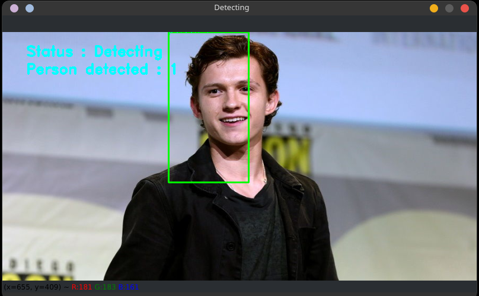
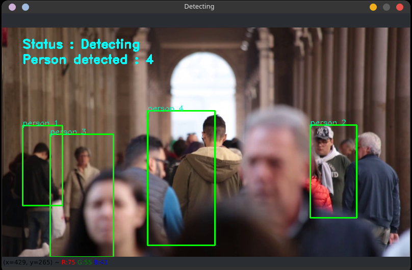

<div align="center" style="text-align: center">

### Count number of person in a video or image

</div>

---

#### About

It is a project I made during my one month internship for `Artificial Intelligence - Computer Vision & Open CV` that count the number of person in a video or image. It is based on the [opencv](https://opencv.org/) library.

#### Usage

```
python src/__main__.py -i | --image | -v | --video <path/to/image/or/video>
```

**Press `q` to exit output window**

#### Dependencies

- [`Imutils`](https://pypi.org/project/imutils/)
- [`OpenCV-Python`](https://pypi.org/project/opencv-python/)

#### Installation of dependencies

- Run the following command in the terminal:

```
pip install -r requirements.txt
```

If you want to install latest version of dependencies, run the following command in the terminal:

```
pip install -r requirements.txt --upgrade
```

or

```
pip install imutils opencv-python
```

## Usage

```console

usage: main.py [-h] [-v VIDEO] [-i IMAGE]

options:
-h, --help            show this help message and exit
-v VIDEO, --video VIDEO
                        path to Video File
-i IMAGE, --image IMAGE
                        path to Image File
```

Example:

```console

> python main.py -v assets/output/people.mp4
[INFO] Opening Image from path.
[INFO] Press q to close window.
[INFO] User Requested An Interrupt.
[INFO] Quitting...
```

Output:



```console
> python main.py -i assets/output/people.jpg
[INFO] Opening Video from path.
[INFO] Press q to close window.
Detecting people...
[INFO] User Requested An Interrupt.
[INFO] Quitting...
```



### Want to contribute to this project?

Follow the [Contributing Guide](./CONTRIBUTING.md)

---

Made with ❤ by [Hemant Sachdeva](https://github.com/HemantSachdeva)
````
